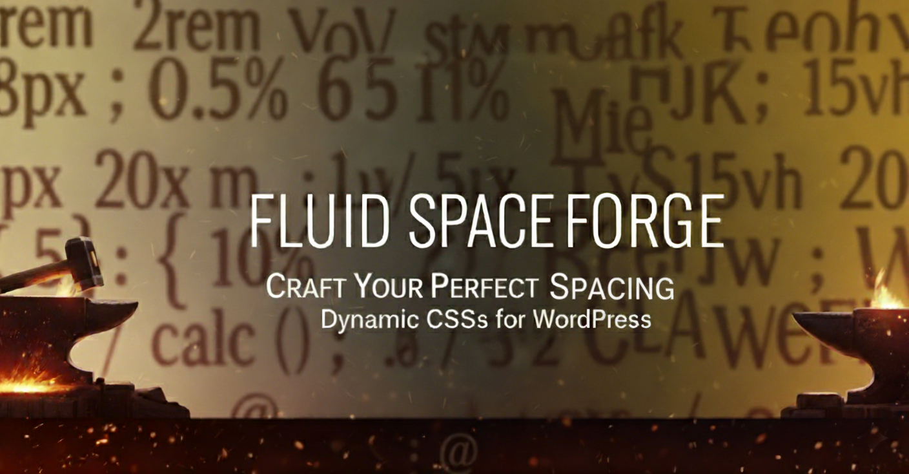
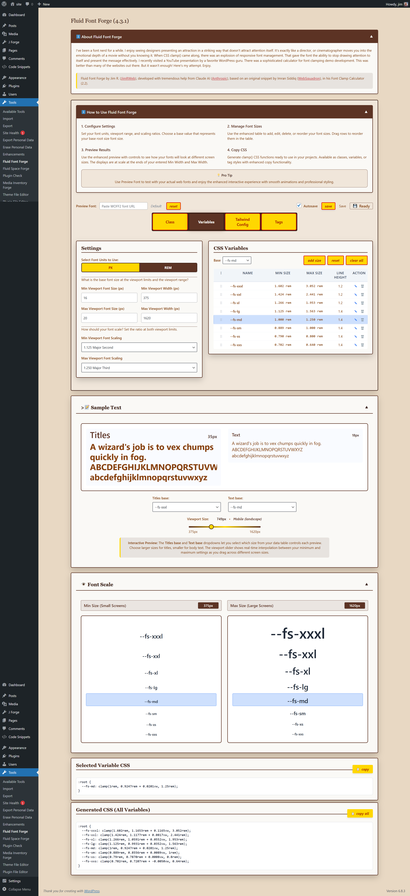

# Fluid Space Forge

<!-- TODO: Add JimRForge logo here - Jim needs to create it -->

**Professional responsive spacing tools for WordPress developers**



A WordPress plugin that generates responsive spacing systems using CSS `clamp()` functions. Create consistent, scalable margins, padding, and gaps that adapt beautifully from mobile to desktop.




## 🚀 Why Fluid Space Forge?

- **Responsive Spacing**: Generate CSS `clamp()` functions for fluid spacing across all device sizes
- **Three Output Formats**:
  - CSS Classes (`.space-lg`, `.space-md`)
  - CSS Custom Properties (`--space-lg`, `--space-md`)
  - Utility Classes (`.mt-lg`, `.p-md`, `.mx-sm`)
- **Live Preview**: See your spacing at different screen sizes in real-time
- **Drag & Drop**: Reorder your spacing scale with intuitive drag-and-drop
- **Mathematical Scaling**: Use proven typographic ratios (Minor Second, Major Third, etc.)
- **Dual Units**: Support for both `px` and `rem` units
- **Two-Tier Autosave**: UI preferences save automatically, data requires manual save (allows refresh-to-undo)
- **Copy to Clipboard**: Copy CSS code with visual feedback
- **Reset Controls**: Restore default settings with confirmation
- **Keyboard Navigation**: Tab and Enter key support for efficient workflow

## 📱 Perfect Companion

Fluid Space Forge is the perfect companion to the **Fluid Font Forge**! While typography scales smoothly across devices, your spacing should too. Together, they create cohesive, responsive design systems.

## 🛠 Installation

### From WordPress.org (Recommended)

1. Go to **Plugins > Add New** in WordPress admin
2. Search for "Fluid Space Forge"
3. Click **Install Now** then **Activate**
4. Access via **Fluid Space Forge** in the admin menu

### Manual Installation

1. Download the plugin ZIP file
2. Go to **Plugins > Add New > Upload Plugin**
3. Choose the ZIP file and click **Install Now**
4. Click **Activate Plugin**
5. Access via **Fluid Space Forge** in the admin menu

## 🎯 Quick Start

1. **Configure Settings**: Set your base spacing values and viewport range
2. **Choose Output Format**: Select Classes, Variables, or Utilities tab
3. **Customize Spacing Scale**: Add, edit, or reorder your spacing sizes
4. **Preview Results**: See live previews at different screen sizes
5. **Copy CSS**: Export your generated CSS code

## 📊 How It Works

The plugin uses linear interpolation to create smooth transitions between your minimum and maximum spacing values:

```css
/* Example output */
.space-md {
  margin: clamp(0.75rem, calc(0.7rem + 0.2vw), 1rem);
}
```

### Mathematical Foundation

- **Base Values**: Define your core spacing at min/max viewports
- **Scaling Ratios**: Use proven ratios like 1.125 (Major Second) or 1.25 (Major Third)
- **Linear Interpolation**: Smooth transitions between viewport breakpoints

## 🎨 Configuration Options

### Viewport Settings
- **Min Viewport**: Smallest screen size (default: 375px)
- **Max Viewport**: Largest screen size (default: 1620px)
- **Min Base Space**: Space size at minimum viewport (default: 8px)
- **Max Base Space**: Space size at maximum viewport (default: 12px)

### Scaling Options
- **1.067** - Minor Second (subtle scaling)
- **1.125** - Major Second (balanced scaling)
- **1.200** - Minor Third (noticeable scaling)
- **1.250** - Major Third (dramatic scaling)
- **1.333** - Perfect Fourth (strong scaling)

## 💼 Output Formats

### CSS Classes
```css
.space-xs { margin: clamp(0.4rem, calc(0.35rem + 0.15vw), 0.5rem); }
.space-sm { margin: clamp(0.6rem, calc(0.55rem + 0.18vw), 0.75rem); }
.space-md { margin: clamp(0.75rem, calc(0.7rem + 0.2vw), 1rem); }
```

### CSS Custom Properties
```css
:root {
  --space-xs: clamp(0.4rem, calc(0.35rem + 0.15vw), 0.5rem);
  --space-sm: clamp(0.6rem, calc(0.55rem + 0.18vw), 0.75rem);
  --space-md: clamp(0.75rem, calc(0.7rem + 0.2vw), 1rem);
}
```

### Utility Classes
```css
.mt-sm { margin-top: clamp(0.6rem, calc(0.55rem + 0.18vw), 0.75rem); }
.mb-sm { margin-bottom: clamp(0.6rem, calc(0.55rem + 0.18vw), 0.75rem); }
.ml-sm { margin-left: clamp(0.6rem, calc(0.55rem + 0.18vw), 0.75rem); }
.mr-sm { margin-right: clamp(0.6rem, calc(0.55rem + 0.18vw), 0.75rem); }
.mx-sm { margin-left: clamp(0.6rem, calc(0.55rem + 0.18vw), 0.75rem); margin-right: clamp(0.6rem, calc(0.55rem + 0.18vw), 0.75rem); }
.my-sm { margin-top: clamp(0.6rem, calc(0.55rem + 0.18vw), 0.75rem); margin-bottom: clamp(0.6rem, calc(0.55rem + 0.18vw), 0.75rem); }
.m-sm { margin: clamp(0.6rem, calc(0.55rem + 0.18vw), 0.75rem); }
```

## 🔧 Technical Requirements

- **WordPress**: 5.0 or higher
- **PHP**: 7.4 or higher
- **Browser**: Modern browsers with CSS `clamp()` support

## 🚨 Browser Support

CSS `clamp()` is supported in:
- ✅ Chrome 79+
- ✅ Firefox 75+
- ✅ Safari 13.1+
- ✅ Edge 79+

For older browsers, consider providing fallback values.

## 🎓 Usage Examples

### Design System Integration
```css
/* Use with your existing design system */
.card {
  padding: var(--space-md);
  margin-bottom: var(--space-lg);
}

.section {
  padding-top: var(--space-xl);
  padding-bottom: var(--space-xl);
}
```

### Component Spacing
```html
<!-- Using utility classes -->
<div class="p-md mb-lg">
  <h2 class="mb-sm">Heading</h2>
  <p class="mb-md">Content with responsive spacing</p>
</div>
```

## 🤝 Contributing

Contributions are welcome! Please feel free to submit issues and pull requests.

### Development Setup
1. Clone the repository
2. Install in WordPress development environment
3. Make changes and test thoroughly
4. Submit pull request with detailed description


## 🙏 Credits

**Fluid Space Forge** is part of the CSS Tools series by:
- **Jim R.** - [JimRForge.com](https://jimrforge.com)
- **Claude AI** - [Anthropic](https://anthropic.com) (Development Assistant)

## 📄 License

This project is licensed under the GPL-2.0+ License - see the WordPress Plugin Repository for details.

## 🆘 Support

- **Issues**: Submit via GitHub Issues
- **Documentation**: [Plugin Documentation](https://jimrforge.com)
- **Community**: WordPress Plugin Support Forum

---

**Made with ❤️ for the WordPress community**

*Create beautiful, responsive spacing systems that scale perfectly across all devices.*